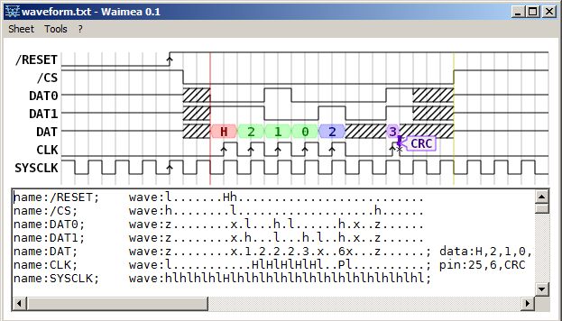

# Waimea
Compact chronogram editor for Windows using OpenGL, written in good ol' VB6.

Why VB6 ?
* I still live in 1999
* Super fast dev cycle for GUI apps
* Small executables
* No framework, only requires a 1.3MB dll (msvbvm60.dll)
* Rather slow execution, but here we only need fast drawing
* Can't be worse than Java !
* I believe that a web browser is a program to browse the web, not an application host
* Not portable but should run in Wine :(

Also: No install, no registry keys.

# Features

* Markdown syntax very similar to [Wavedrom](https://github.com/drom/wavedrom/)'s
* Fast and clean OpenGL rendering
* Drag-scroll for large chronograms
* Rulers
* Modifiable layout/appearence (not as flexible as Wavedrom)
* Popup notes (pins)
* To come: Export to image (and svg ?)

# Syntax

A wave name starts with `name:` and a string.

A wave definition starts with `wave:`:
* `.` (dot): Repeat last block
* `z` : Hi-Z
* `x` : Undefined
* `l` : Low
* `h` : High
* `L` : Falling with arrow
* `H` : Rising with arrow
* `n` : Clock negative
* `p` : Clock positive
* `N` : Clock negative with arrow
* `P` : Clock positive with arrow
* `=` : Data (grey)
* `0~5` : Data (colored)

Text for data zones starts with `data:` and strings (with no spaces) separated by commas.
A vertical ruler can be set with `ruler:`, a x position, and a color index.
A note can be added with `pin:`, a x position, a color index, and a string.

# Layout.txt format

A block definition starts with the `DEF` keyword followed by the letter assigned to the block. Any text after the letter is ignored, it can be used as a comment to describe the block.

The drawing commands follow on the next line. The currently supported commands are:
* `SP`: Start Point. Required, defines the block's starting point for hookup. Takes x,y.
* `EP`: Ending Point. Required, defines the block's ending point for hookup. Takes x,y.
* `L`: Line. Simply draws a line. Takes x1,y1:x2,y2.
* `LS`: Line strip. Draws multiples lines, one connected to the other. Takes x1,y1:x2,y2:x3,y3...
* `SH`: Shape. Draws a filled polygon. Takes x1,y1:x2,y2:x3,y3...

Coordinates 0,0 are top-left.

For example, drawing a filled square clockwise: `SH 0,0:16,0:16,16:0,16`
